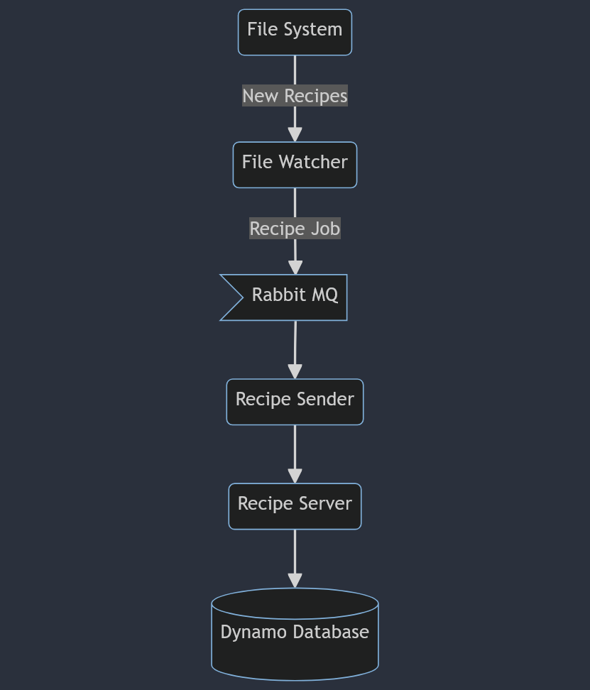
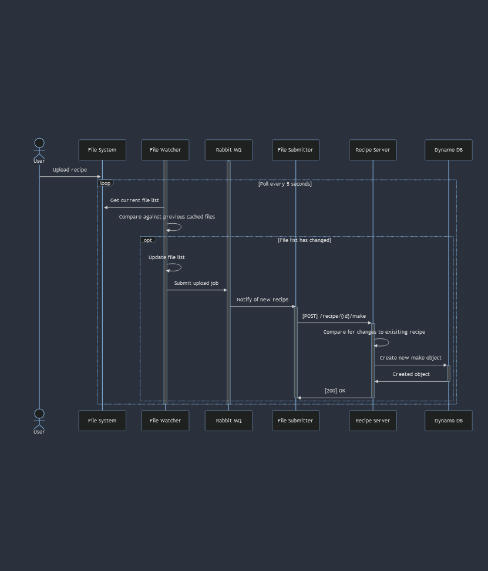
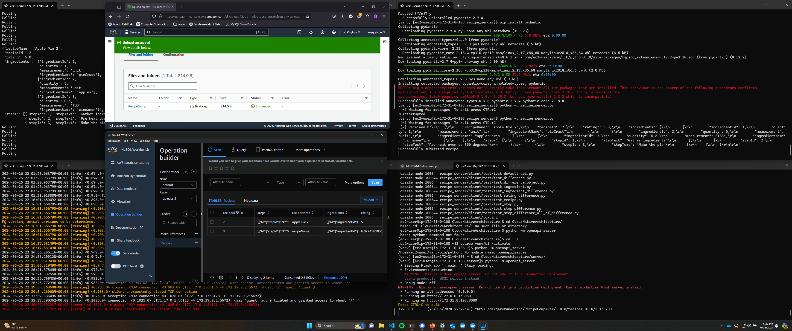
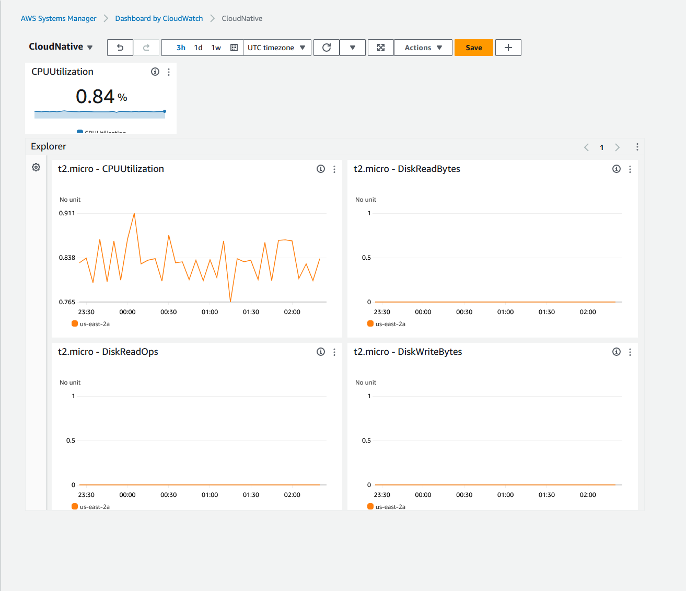

# Project 1
> Meg Anderson
> 
> Professor Art Sedighi 
> 
> EN.605.702.8VL.SU24

## Description
- Build a distributed application (3 or more components) that executes a business process or application.
- This application needs to be on the cloud and will use 3 of the following technology components: messaging, queuing, caching, and databases. 
- Additional components such as storage, vm is fine, but no functions 
  

## Required Deliverables:
Working end-to-end solution and Implementation detail
- Screen shots of your project working
- Source code
Meeting the requirement
- Describing the use case. You are free to choose the use case, but you need
to describe it
Architecture diagram of your solution including data flow
- Integration with native cloud logging and monitoring
- Write-up

## Problem Statement 

The use-case I have created is one for recipes.  Every-time a recipe is made, that recipe can be made exactly, or with modifications. When a recipe
is made, that recipe begins in our system as a JSON file that is placed in some common location, in this case
some shared file location. That file location is regularly polled by a file watcher for changes. When the poller
notices that a file has been created, it creates an upload job. This job is then completed by a separate service
that submits the job to our comparison server. This server then finds any changes between the original recipe
and this make of the recipe, and stores those in a database to be analyzed later and eventually displayed on a
dashboard.

## Diagrams and labeled components 
### Components of system
1. `The File System` is the first component. The user will upload files to this location in this place.
2. `The File Watcher` consistently polls the  S3 bucket for changes. 
3. `The Rabbit MQ` stores file submission jobs. 
4. `The File Sender` is essentially a client to the server.
5. `The Recipe Server` is responsible for finding the differences between a make of a recipe and the original and storing that back to the database.
6. `The Dynamo Database` where the recipe makes are stored.  


### Sequence Diagram


## Implementation description
1. `The File System` is just an S3 Bucket in this case. 
2. `The File Watcher` is a python script that is consistently polling the  S3 bucket for changes. It maintains a local cache of the previous unique files. In this case, that cache is just directly an in-memory object, although with a greater number of objects it could be replaced with some larger / more organized cache (EX. Redis). The File Watcher publishes to the queue.
3. `The Rabbit MQ` stores file submission jobs. This allows the file watcher and file sender to communicate with one another. Ultimately, it's a little extraneous, but I wanted to try using it and I figure it will make swapping it for some other form of communication easier later.
4. `The File Sender` is also a python script that is subscribed to the queue. It sends the new recipe to the server and is responsible for the formatting, but ultimately it's pretty straightforward. The client is generated from open API generator. 
5. `The Recipe Server` is a generated flask server from an open API generator. 
6. `The Dynamo Database` where the recipe makes are stored. 
   
### OpenAPI REST 

```
openapi: 3.0.0
info:
  description: |
    This is a recipe comparer tool      
  version: "1.0.0"
  title: Recipe Comparison
  termsOfService: 'http://swagger.io/terms/'
  contact:
    email: megretson@gmail.com
  license:
    name: Apache 2.0
    url: 'http://www.apache.org/licenses/LICENSE-2.0.html'
servers:
  # Added by API Auto Mocking Plugin
  - description: SwaggerHub API Auto Mocking
    url: https://virtserver.swaggerhub.com/MargaretAnderson/RecipeComparer/1.0.0
  - url: 'https://megretson.com/recipeProject/v1'
paths:
  /recipes:
    post:
      summary: add a new recipe
      operationId: addRecipe
      requestBody:
        content:
          application/json:
            schema:
              $ref: '#/components/schemas/recipe'
      responses:
        '200':
          description: Success
          content:
            application/json:
              schema:
                $ref: '#/components/schemas/recipe'
        '400':
          description: Invalid ID supplied
        '404':
          description: Recipe not found
        '405':
          description: Validation exception
    put:
      summary: update a recipe
      operationId: updateRecipe
      requestBody:
        content:
          application/json:
            schema:
              $ref: '#/components/schemas/recipe'
      responses:
        '200':
          description: Success
          content:
            application/json:
              schema:
                $ref: '#/components/schemas/recipe'
        '400':
          description: Invalid ID supplied
        '404':
          description: Recipe not found
        '405':
          description: Validation exception
        
  '/recipes/{recipeId}/makes':
    post:
      summary: say that you made a recipe
      operationId: addRecipeMake
      parameters:
        - name: recipeId
          in: path
          description: ID of recipe to return
          required: true
          schema:
            type: integer
            format: int64
      requestBody:
        content:
          application/json:
            schema:
              $ref: '#/components/schemas/recipe'
      responses:
        '200':
          description: Success
          content:
            application/json:
              schema:
                $ref: '#/components/schemas/recipe'
        '400':
          description: Invalid ID supplied
        '404':
          description: Recipe not found
        '405':
          description: Validation exception
  '/recipes/{recipeId}':
    get: 
      summary: Recieve information on a recipe
      operationId: getRecipe
      parameters:
        - name: recipeId
          in: path
          description: ID of recipe to return
          required: true
          schema:
            type: integer
            format: int64
      responses:
        '200':
          description: Success
          content:
            application/json:
              schema:
                $ref: '#/components/schemas/recipe'
        '400':
          description: Invalid ID supplied
        '404':
          description: Recipe not found
        '405':
          description: Validation exception
  '/recipes/{recipeId}/makes/{makeId}':
    get: 
      summary: Recieve information on a given make of a recipe
      operationId: getRecipeMake
      parameters:
        - name: recipeId
          in: path
          description: ID of recipe to return
          required: true
          schema:
            type: integer
            format: int64
        - name: makeId
          in: path
          description: ID of make to return
          required: true
          schema:
            type: integer
            format: int64
      responses:
        '200':
          description: Success
          content:
            application/json:
              schema:
                $ref: '#/components/schemas/recipe'
        '400':
          description: Invalid ID supplied
        '404':
          description: Recipe not found
        '405':
          description: Validation exception
  '/recipes/{recipeId}/makes/{makeId}/differences':
    get: 
      summary: Recieve information on a given make of a recipe, including any variations between the make and the actual recipe
      operationId: getRecipeMakeDifferences
      parameters:
        - name: recipeId
          in: path
          description: ID of recipe to return
          required: true
          schema:
            type: integer
            format: int64
        - name: makeId
          in: path
          description: ID of make to return
          required: true
          schema:
            type: integer
            format: int64
      responses:
        '200':
          description: Success
          content:
            application/json:
              schema:
                $ref: '#/components/schemas/recipe'
        '400':
          description: Invalid ID supplied
        '404':
          description: Recipe not found
        '405':
          description: Validation exception
  
components:
  schemas:
    recipe:
      type: object
      properties:
        recipeName:
          type: string
        recipeId:
          type: number
        rating:
          type: number
        ingredients:
          $ref: '#/components/schemas/ingredients'
        steps:
          $ref: '#/components/schemas/steps'
    ingredients:
      type: array
      items:
        $ref: '#/components/schemas/ingredient'
    ingredient:
      type: object
      properties:
        ingredientId:
          type: number
        quantity:
          type: number
        measurement:
          type: string
        ingredientName:
          type: string
    steps:
      type: array
      items: 
        $ref: '#/components/schemas/step'
    step:
      type: object
      properties:
        stepId:
          type: number
        stepText: 
          type: string
    differences:
      type: array
      items: 
        $ref: '#/components/schemas/differenceObject'
    differenceObject:
      type: object
      properties:
        recipeField:
          type: string
          enum: 
            - rating
            - ingredient
            - instruction
        recipeId:
          type: number
        makeId:
          type: number
        difference:
          $ref: '#/components/schemas/difference'
      required:
        - recipeField
        - recipeId
        - makeId
        - difference
    ratingDifference:
      allOf:     # Combines the BasicErrorModel and the inline model
        - $ref: '#/components/schemas/differenceObject'
    ingredientDifference:
      allOf:     # Combines the BasicErrorModel and the inline model
        - $ref: '#/components/schemas/differenceObject'
        - type: object
          required:
            - ingredientId
            - ingredientField
            - difference
          properties:
            ingredientId:
              type: number
            ingredientField:
              type: string
              enum:
                - quantity
                - measurement
                - ingredientName
            difference:
              $ref: '#/components/schemas/difference'
    stepDifference:
      allOf:     # Combines the BasicErrorModel and the inline model
        - $ref: '#/components/schemas/differenceObject'
        - type: object
          required:
            - difference
          properties:
            difference:
              type: object
              properties:
                stepId:
                  type: number
              required:
                - stepId
    difference:
      type: object
      properties:
        recipe:
          type: string
        make:
          type: string
```

## Current code shortcomings and next steps 

For this project I didn't have a chance to finish my recipe comparer. This is the part of the server that actually finds the differences between some make of a recipe and the original. You can see this is my source code, because the endpoints related to makes, IE:
- `GET /recipes/{recipeId}/makes/{makeId}/differences`
- `GET /recipes/{recipeId}/makes/{makeId}`
- `POST /recipes/{recipeId}/makes`
  
are not complete and still have default implementations / TODOs. Thus the flow that currently works in my code is just submitting a new recipe to the database or querying an exisiting one, ie:
- `GET /recipes/{recipeId}`
- `POST /recipes/`
  
## Screenshots of working code 

The upper left corner is the file watcher, which prints "Polling" until the recipe is uploaded, and the prints the file contents.

The bottom left is the Rabbit MQ, which prints when something is queued.

The upper right is the file sender, which prints the contents of the recipe when it receives it from the queue.

The bottom right is the server, which prints the endpoint that was hit and the response (200 in this case).

In the middle on the top is the S3 bucket where I uploaded a new recipe file.

The the middle on the bottom is a viewer for the dynamo db where you can see the new recipe ("Apple Pie 2") has been uploaded. 


This shows my CloudWatch dashboard for this EC2 instance, which is not very interesting at this moment. All of these could be deployed on their own instances, but I only get one instance for free so they're all crowded up there at the moment, hence why my CPU utilization is at 82%! 

## Source code
All source code is on my github: 
https://github.com/megretson/CloudNativeArchitecture
