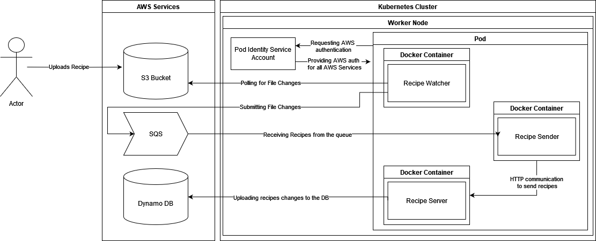
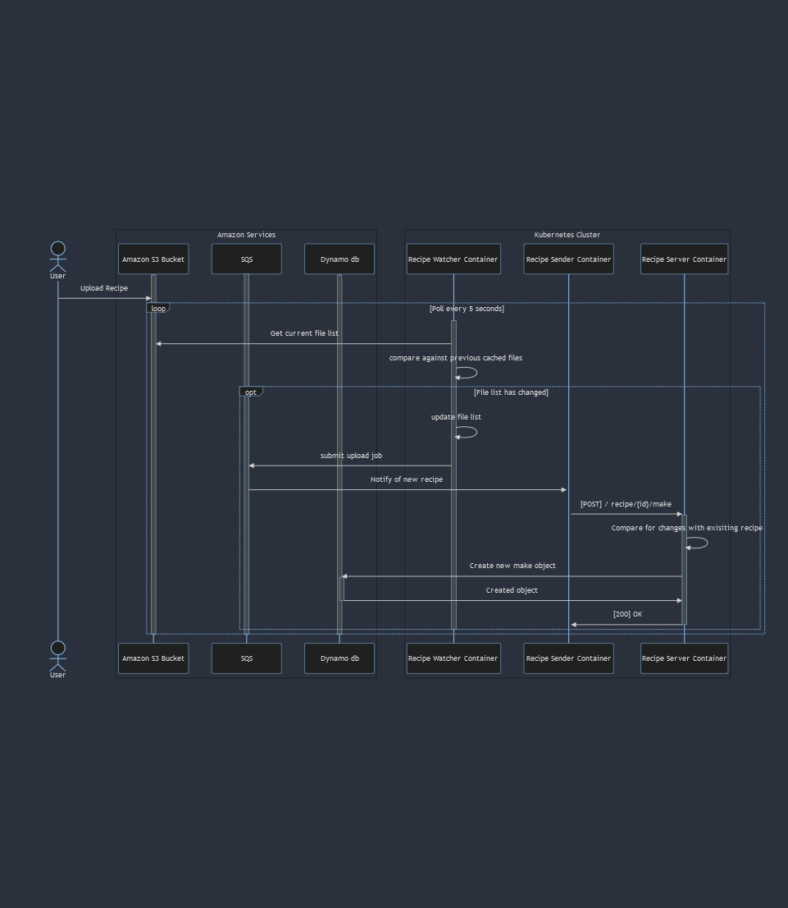
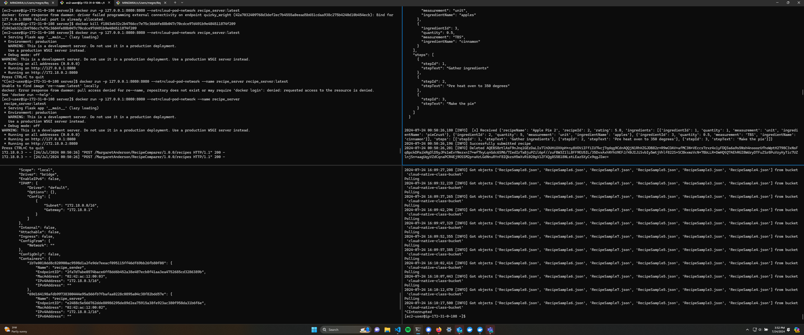
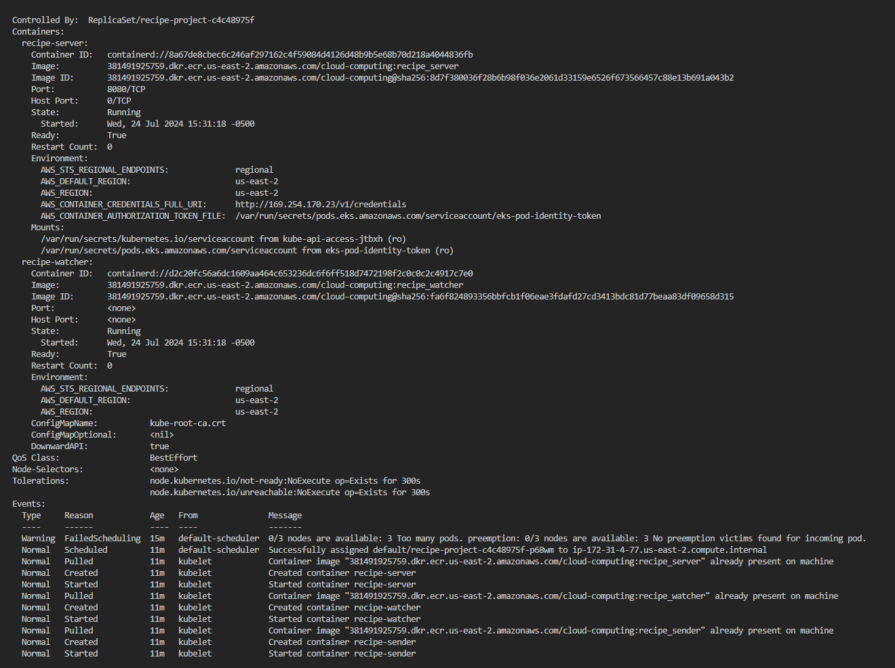
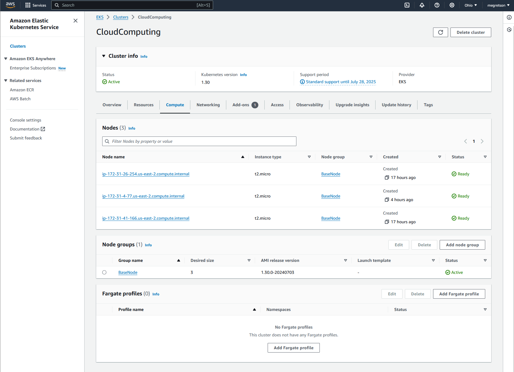
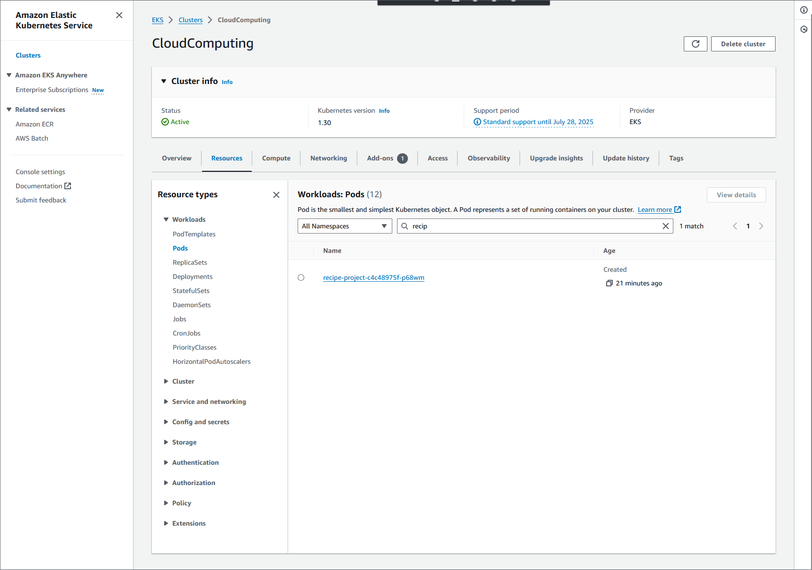

# Project 2
> Meg Anderson
> 
> Professor Art Sedighi 
> 
> EN.605.702.8VL.SU24

## Description
- Build a distributed application (3 or more components) that executes a business process or application 
- This application needs to be on the cloud and use 3 of the following technologies: docker, kubernetes, mesh, microservices
- The application needs at least 3 docker containers 
  

## Required Deliverables:
- [30 points] Demonstrates end-to-end working of the project
- [20 points] Built a distributed application with at least 3 components: Docker, Kubernetes, Mesh, Microservices
- [10 points] CICD for deployment
- [10 points] Completeness of the report and detailed architecture
- [20 points] Source code included, yaml file, Dockerfile
- [10 points] Business process or application that resembles real-world problem

## Original Problem Statement 

The use-case I have created is one for recipes.  Every-time a recipe is made, that recipe can be made exactly, or with modifications. When a recipe
is made, that recipe begins in our system as a JSON file that is placed in some common location, in this case
some shared file location. That file location is regularly polled by a file watcher for changes. When the poller
notices that a file has been created, it creates an upload job. This job is then completed by a separate service
that submits the job to our comparison server. This server then finds any changes between the original recipe
and this make of the recipe, and stores those in a database to be analyzed later and eventually displayed on a
dashboard.

## Implementation description

### Component Description
1. `The File System` is just an S3 bucket
2. `The File Watcher` is a containerized python application that is consistently polling the  S3 bucket for changes. It maintains a local cache of the previous unique files. In this case, that cache is just directly an in-memory object, although with a greater number of objects it could be replaced with some larger / more organized cache (EX. Redis). The File Watcher publishes to the queue.
3. `Amazon SQS` stores jobs from the file watcher for the file sender. This allows the file watcher and file sender to communicate with one another. 
4. `The File Sender` is also a containerized python application that is subscribed to the queue. It sends the new recipe to the server and is responsible for the formatting, but ultimately it's pretty straightforward. The client is generated from open API generator. 
5. `The Recipe Server` is a generated flask server from an open API generator deployed in a docker container listening on 8080. 
6. `The Dynamo Database` where the recipe makes are stored. 

### Summary of component changes between projects
| Component       | Project 1 Version                                                                | Project 2 Version                                                    |
|-----------------|----------------------------------------------------------------------------------|----------------------------------------------------------------------|
| File System     | S3 Bucket                                                                        | S3 bucket                                                            |
| File Watcher    | Executable python script `recipe_watcher.py` running directly on an EC2 instance | Containerized, and running on a cluster with the sender and server   |
| Messaging Queue | Rabbit MQ deployed as a docker container running on an EC2 instance              | Replaced with Amazon SQS                                             |
| File Sender     | Executable python script `recipe_sender.py` running directly on an EC2 instance  | Containerized, and running on a cluster with the watcher and server  |
| Recipe Server   | Running as an installed python package on the EC2 instance                       | Containerized, and running on a cluster with the watcher and sender  |

### Architecture Diagram


### Sequence Diagram


## Use of Microservices
My recipe server is a great encapsulation of a REST microservice. It is exclusively responsible for the single job of managing CRUD of recipe objects and recipe difference objects. It also allows the DB to maintain a separate DAO from the more human-readable DAO used for communication with the REST server.  For full documentation on the REST API see [here](https://github.com/megretson/CloudNativeArchitecture/blob/main/openaPISchema.yaml).

## Use of Docker 
All three of the services I implemented are containerized. Full DockerFiles for each are available on [my github](https://github.com/megretson/CloudNativeArchitecture), but a sample docker container for the recipe server is provided here:

```
FROM python:3-alpine

RUN mkdir -p /usr/src/app
WORKDIR /usr/src/app

COPY requirements.txt /usr/src/app/

RUN pip3 install --no-cache-dir -r requirements.txt

COPY . /usr/src/app

ENV AWS_DEFAULT_REGION=us-east-2

EXPOSE 8080

ENTRYPOINT ["python3"]

CMD ["-m", "openapi_server"]
```

All of my services run on Alpine and are functionally identical. For this project, my stretch goal was to get each of the containers to authenticate with AWS without directly providing credentials files into the containers, as this is obviously insecure rather than using some short-lived authentication method. Ultimately I was able to do this by using EKS pod identities, and to grant the entire pod access to the other AWS services I was using (Dynamo, SQS, and S3 buckets). Thus, the only environment variable I set within my DockerFile was the region for the cluster. 

## Use of Kubernetes 
Deploying my containers to Kubernetes was the biggest challenge of this project for me. 
Here is my deployment-manifest for this project:
```
apiVersion: v1
kind: ServiceAccount
metadata:
  annotations:
    eks.amazonaws.com/role-arn: arn:aws:iam::381491925759:role/DockerRole
  name: recipe-service-account
  namespace: default
---
apiVersion: apps/v1
kind: Deployment
metadata:
  creationTimestamp: null
  labels:
    app: recipe-project
  name: recipe-project
spec:
  replicas: 1
  selector:
    matchLabels:
      app: recipe-project
  strategy: {}
  template:
    metadata:
      creationTimestamp: null
      labels:
        app: recipe-project
    spec:
      serviceAccountName: recipe-service-account
      containers:
      - image: 381491925759.dkr.ecr.us-east-2.amazonaws.com/cloud-computing:recipe_server
        name: recipe-server
        resources: {}
        ports:
          - containerPort: 8080
      - image: 381491925759.dkr.ecr.us-east-2.amazonaws.com/cloud-computing:recipe_watcher
        name: recipe-watcher
        resources: {}
      - image: 381491925759.dkr.ecr.us-east-2.amazonaws.com/cloud-computing:recipe_sender
        name: recipe-sender
        resources: {}
status: {}
```
My cluster is organized around a service account which provides the authentication for each container to the other AWS services through pod identity access. Each pod contains the recipe watcher, recipe sender, and server containers. 
  
## Screenshots of working code 
### Code in use

The upper left corner is the file watcher, which prints "Polling" until the recipe is uploaded, and the prints the file contents.

The bottom left is the Rabbit MQ, which prints when something is queued.

The upper right is the file sender, which prints the contents of the recipe when it receives it from the queue.

The bottom right is the server, which prints the endpoint that was hit and the response (200 in this case).

In the middle on the top is the S3 bucket where I uploaded a new recipe file.

The the middle on the bottom is a viewer for the dynamo db where you can see the new recipe ("Apple Pie 2") has been uploaded. 

### Kubernetes Cluster Status

This shows the status of my Kube cluster. You can see an initial failure while it looked for a node to deplopy the pod on then, then the successful runs following. 

Additionally, in the above screenshot you can see tha tmy service account has successfully provided AWS tokens to each of my containers through their `AWS_CONTAINER_AUTHORIZATION_TOKEN_FILE` environment variable. 

### Kubernetes Nodes Status


This shows the nodes I had allocated to this cluster. HEre, I have allocated 3 micro EC2 instances. 

### Kubernetes Pods Status


Here shows the running pod from the AWS console. 


## Current code shortcomings and next steps 

I believe the better deployment for my cluster would be to have the recipe sender and watcher collocated within a pod, but the server within it's own pod such that they network pod-to-pod rather than container to container. However, my strong suspicion is that I will ultimately scrap my server in favor of using API gateway for the next project. 

I also did not have time to complete a CI/CD pipeline for this project, and I intend to set one up prior to the next project and resubmit. 

## Source code
All source code is on my github: 
https://github.com/megretson/CloudNativeArchitecture
