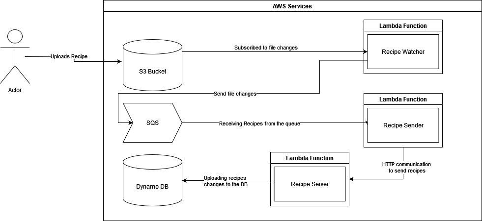
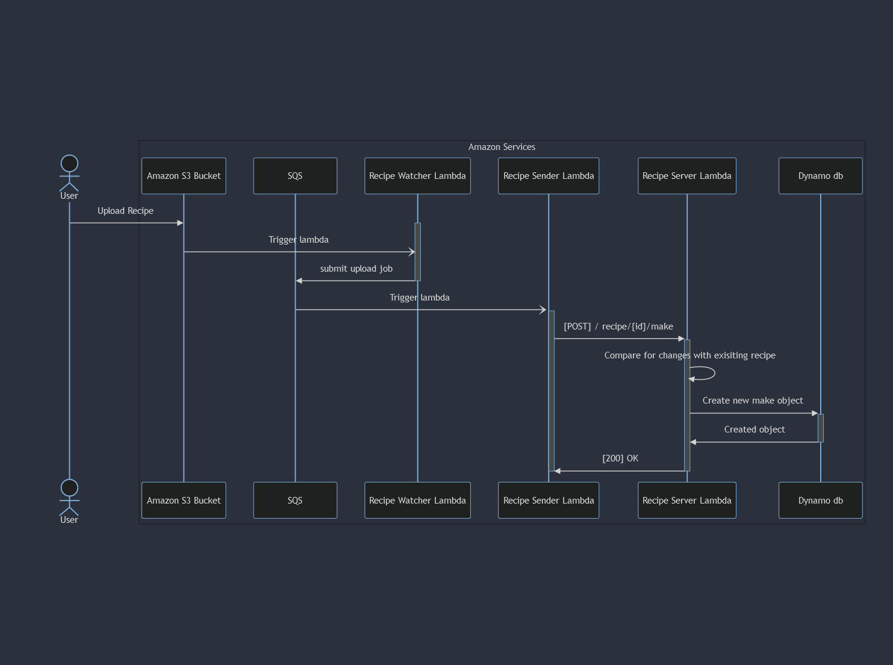
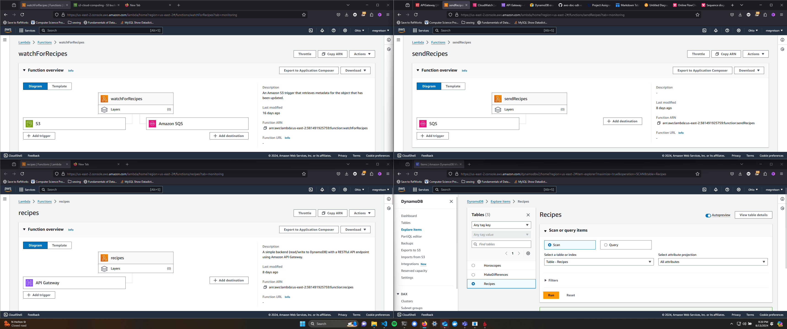
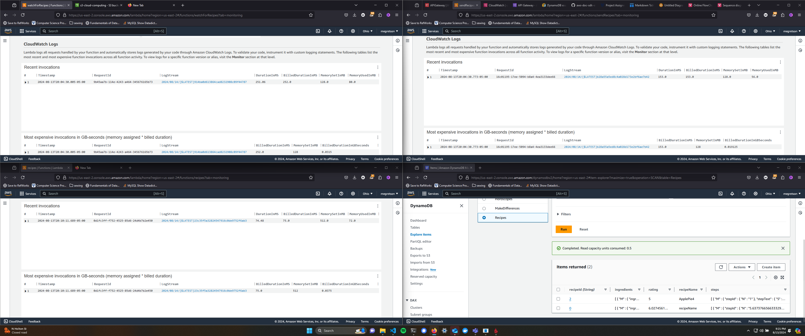

# Project 3
> Meg Anderson
> 
> Professor Art Sedighi 
> 
> EN.605.702.8VL.SU24

## Description
- Build a distributed application (3 or more components) that executes a business process or application 
- This application must be entirely serverless
- You are not allowed to use a VM, a server-based database, or any component requiring a VM
  

## Required Deliverables:
- [30 points] Demonstrates end-to-end working of the project
- [20 points] Built a distributed application with at least 3 serverless components (AWS Lambda or Azure/GCP functions) 
- [10 points] CICD for deployment
- [10 points] Completeness of the report and detailed architecture
- [20 points] Source code included
- [10 points] Business process or application that resembles real-world problem

## Original Problem Statement 

The use-case I have created is one for recipes.  Every-time a recipe is made, that recipe can be made exactly, or with modifications. When a recipe
is made, that recipe begins in our system as a JSON file that is placed in some common location, in this case
some shared file location. That file location is regularly polled by a file watcher for changes. When the poller
notices that a file has been created, it creates an upload job. This job is then completed by a separate service
that submits the job to our comparison server. This server then finds any changes between the original recipe
and this make of the recipe, and stores those in a database to be analyzed later and eventually displayed on a
dashboard.

## Implementation description

### Component Description
1. `The File System` is just an S3 bucket
2. `The File Watcher` is a lambda function. The trigger for this function is uploads to the S3 bucket. The File Watcher publishes to the queue.
3. `Amazon SQS` stores jobs from the file watcher for the file sender. This allows the file watcher and file sender to communicate with one another. 
4. `The File Sender` is also a lambda functions, the trigger for which is messages in the SQS. It sends the new recipe to the server and is responsible for the formatting. 
5. `The Recipe Server` is an api gateway backed with, surprise, lambda functions. 
6. `The Dynamo Database` where the recipe makes are stored. 

### Summary of component changes between projects
| Component       | Project 1 Version                                                                | Project 2 Version                                                    | Project 3 Version                                                                   |
|-----------------|----------------------------------------------------------------------------------|----------------------------------------------------------------------|-------------------------------------------------------------------------------------|
| File System     | S3 Bucket                                                                        | S3 bucket                                                            | S3 Bucket                                                                           |
| File Watcher    | Executable python script `recipe_watcher.py` running directly on an EC2 instance | Containerized, and running on a cluster with the sender and server   | Replaced with a lambda function. Trigger: S3 File Upload. Destination: SQS          |
| Messaging Queue | Rabbit MQ deployed as a docker container running on an EC2 instance              | Replaced with Amazon SQS                                             | Amazon SQS                                                                          |
| File Sender     | Executable python script `recipe_sender.py` running directly on an EC2 instance  | Containerized, and running on a cluster with the watcher and server  | Replaced with a lambda function. Trigger: SQS message. Destination: REST API call.  |
| Recipe Server   | Running as an installed python package on the EC2 instance                       | Containerized, and running on a cluster with the watcher and sender  | Replaced with API Gateway backed by lambda functions. Destination: Dynamo DB        |
| Database        | Dynamo DB                                                                        | Dynamo DB                                                            | Dynamo DB                                                                           |

### Architecture Diagram

### Sequence Diagram

  
## Screenshots of working code 
### Code in use

The top image shows what each component is. 

The upper left corner is the file watcher.

The upper right corner is the file sender.

The bottom left corner is the recipe server lambda which is invoked. 

The bottom right is the dynamo db, showing that a recipe has been uploaded.

## Current code shortcomings and next steps 

I did not set up an automated deployment for my lambda functions due to time constraints, and, as is the case with most of my grad school projects, it has poor / insufficient automated testing. All testing was done manually. 

Additionally, as discussed in class, my project was not built with security in mind. My recipe server is currently running open to the internet, so anyone could create objects within my dynamo db until I shut it down. If I were to iterate on this project with security in mind, I would have a particular eye towards authenticating clients of my recipe server. This should be relatively straightforward with some sort of auth token. 

For my job, security is oftentimes a tricky problem. We have strong security on the borders of our system, but within the system all microservices operate as trusted / safe. Our software currently runs almost exclusively on device, meaning this has been sufficient for us in the past. This project was meant to operate as a basic prototype for a use-case at work. In the "real-life" version of this problem, protected health information would be sent rather than recipes, which would require a far tighter approach to security than I have taken here. After this class, I intend to do a ghost "project 4" where I implement a secure version of this same project. 

Thank you for your time over the semester Dr. Sedighi. It's been incredibly useful to have your guidance over the semester to help me shift my thinking towards cloud deployments, and I've been grateful to have the impetuous to experiment with tools I don't have a chance to use at work. 

## Source code
All source code is on my github: 
https://github.com/megretson/CloudNativeArchitecture
